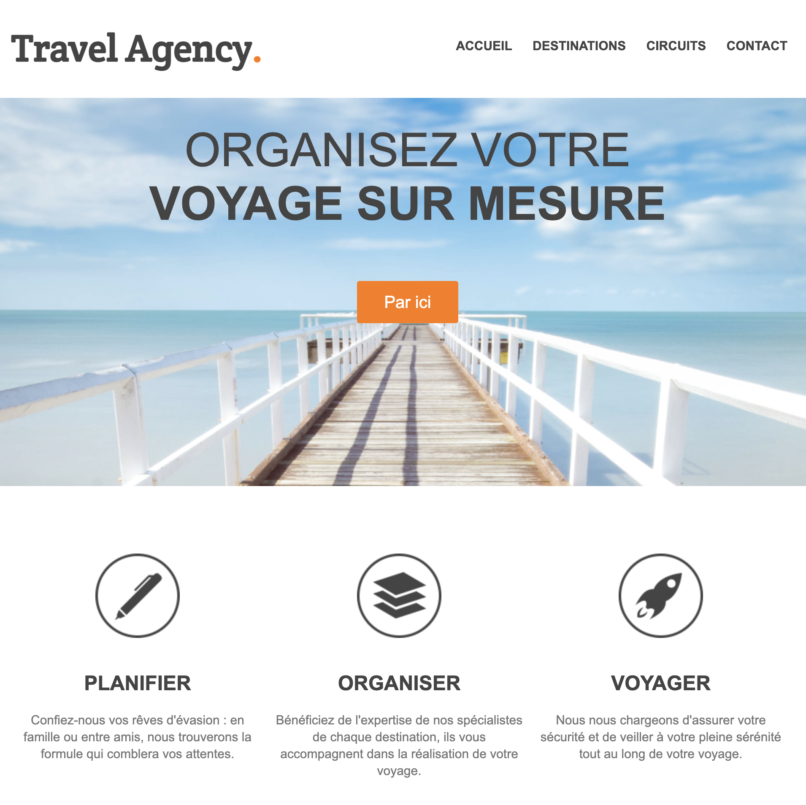

```markdown
# 🌍 Travel Agency Website

Bienvenue sur le projet de création d'un site d'agence de voyage. Ce projet est conçu pour fournir une interface utilisateur agréable et moderne pour une agence de voyage, permettant aux utilisateurs de planifier, organiser et réserver leurs voyages en toute simplicité.

## 📋 Contenu

- [Aperçu](#aperçu)
- [Technologies](#technologies)
- [Installation](#installation)
- [Structure du Projet](#structure-du-projet)
- [Fonctionnalités](#fonctionnalités)
- [Crédits](#crédits)
- [Licence](#licence)

## 🌟 Aperçu



Ce site se compose de plusieurs sections, notamment une page d'accueil, des descriptions des destinations, des circuits de voyage, ainsi qu'une section de contact.

## 💻 Technologies

Ce projet utilise les technologies suivantes :
- HTML5
- CSS3
- Google Fonts

## 🚀 Installation

Pour cloner et exécuter ce projet, vous aurez besoin de [Git](https://git-scm.com) et d'un navigateur web moderne.

```bash
# Cloner le dépôt
git clone https://github.com/votre-utilisateur/votre-depot.git

# Accédez au répertoire du projet
cd votre-depot

# Ouvrez index.html dans votre navigateur préféré
```

## 📂 Structure du Projet

Voici un aperçu de la structure des fichiers du projet :

```
.
├── images
│   ├── article-image-1.jpg
│   ├── article-image-2.jpg
│   ├── main.jpg
│   ├── steps-icon-1.png
│   ├── steps-icon-2.png
│   ├── steps-icon-3.png
│   └── screenshot.png
├── index.html
└── style.css
```

## ✨ Fonctionnalités

### 🏠 Header
- Contient le logo et la navigation principale.

### 📸 Section Principale
- Une grande image d'accueil avec un slogan et un bouton d'appel à l'action.

### 🗺️ Étapes
- Décrit les trois étapes principales pour organiser un voyage : Planifier, Organiser, et Voyager.

### 🏖️ Possibilités
- Présente deux articles avec des images et des descriptions pour différentes options de voyage.

### 📞 Contact
- Contient un formulaire de contact permettant aux utilisateurs de soumettre leurs informations pour être recontactés.

### 📜 Footer
- Inclut le logo de l'agence et une mention de droits d'auteur.

## 🙏 Crédits

- Design et développement par [Votre Nom](https://github.com/barryelhadj23).
- Police utilisée : [Crete Round](https://fonts.google.com/specimen/Crete+Round).

## 📄 Licence

Ce projet est sous licence MIT. Voir le fichier [LICENSE](LICENSE) pour plus de détails.
```
